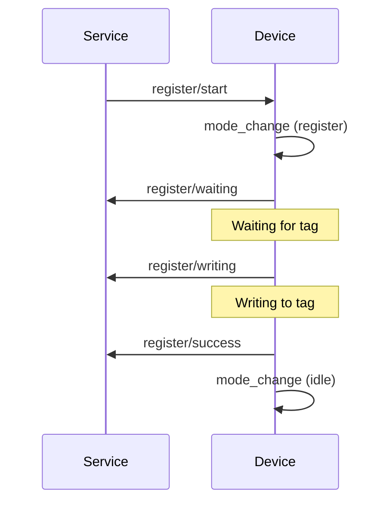
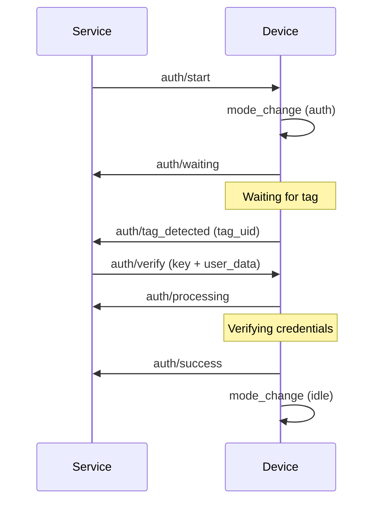
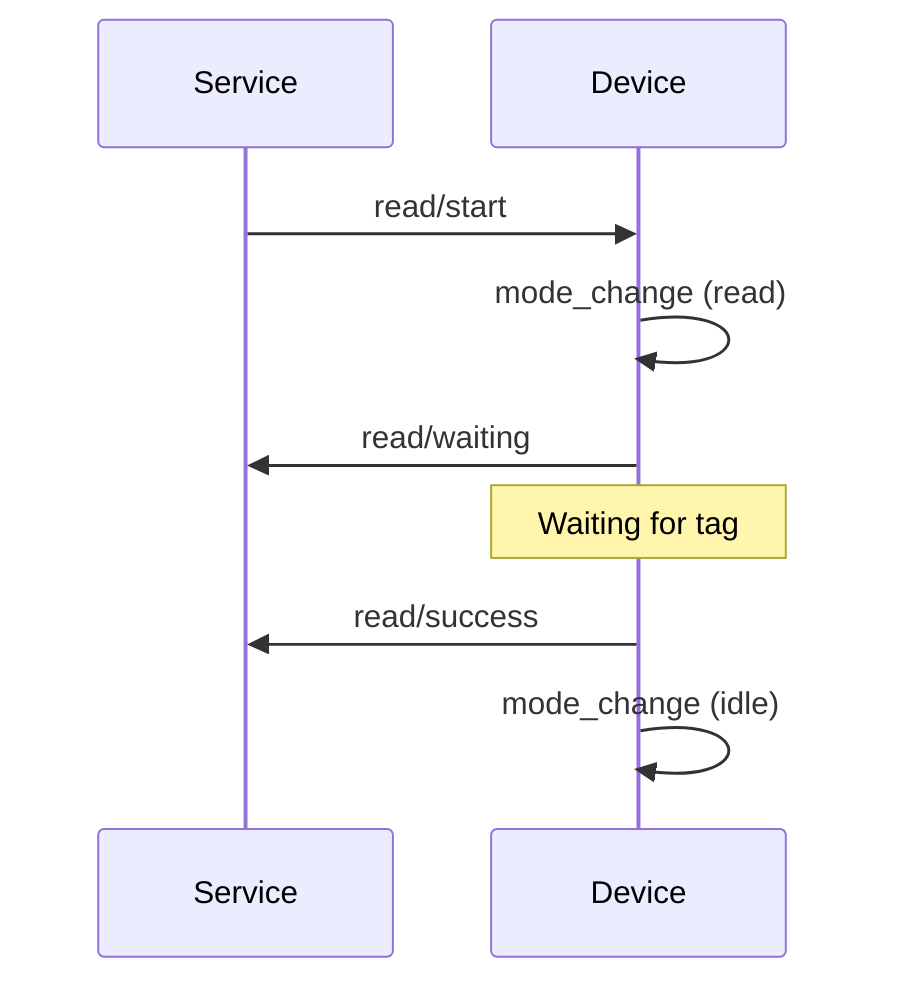

# MQTT Protocol Specification
## LibreTap TapService & TapReader


## Table of Contents
1. [Overview](#1-overview)
2. [Topic Hierarchy](#2-topic-hierarchy)
3. [Message Format](#3-message-format)
4. [Operations](#4-operations)
5. [QoS & Retention](#5-qos--retention)
6. [Error Handling](#6-error-handling)
7. [Security](#7-security)
8. [Implementation Examples](#8-implementation-examples)

---

## 1. Overview

This specification defines MQTT communication between ESP32-based NFC readers (TapReader) and the FastAPI backend (TapService).

### Key Principles
- **Device-Authoritative**: Devices own their state; service synchronizes on event confirmation
- **Asynchronous**: Commands return immediately; results arrive via events
- **Idempotent**: All messages include `request_id` for deduplication and tracing
- **Reliable**: QoS 1 for commands/results, QoS 0 for progress updates


---

## 2. Topic Hierarchy

### 2.1 Topic Structure
```
devices/{device_id}/{operation}/{action}
devices/{device_id}/status
devices/{device_id}/mode
devices/{device_id}/heartbeat
```

### 2.2 Operations & Actions

**Registration:**
- Commands: `devices/{device_id}/register/start`, `devices/{device_id}/register/cancel`
- Events: `devices/{device_id}/register/waiting`, `devices/{device_id}/register/writing`, `devices/{device_id}/register/success`, `devices/{device_id}/register/error`

**Authentication:**
- Commands: `devices/{device_id}/auth/start`, `devices/{device_id}/auth/verify`, `devices/{device_id}/auth/cancel`
- Events: `devices/{device_id}/auth/waiting`, `devices/{device_id}/auth/tag_detected`, `devices/{device_id}/auth/processing`, `devices/{device_id}/auth/success`, `devices/{device_id}/auth/failed`, `devices/{device_id}/auth/error`

**Read:**
- Commands: `devices/{device_id}/read/start`, `devices/{device_id}/read/cancel`
- Events: `devices/{device_id}/read/waiting`, `devices/{device_id}/read/success`, `devices/{device_id}/read/error`

**Control:**
- Command: `devices/{device_id}/reset`

**State (Retained):**
- `devices/{device_id}/status` - Device online/offline
- `devices/{device_id}/mode` - Current mode: idle|register|auth|read

**Health:**
- `devices/{device_id}/heartbeat` - Periodic health metrics

---

## 3. Message Format

### 3.1 Envelope Structure
All MQTT messages use this envelope:

```json
{
  "version": "1.0",
  "timestamp": "2025-11-11T12:00:00.000Z",
  "device_id": "reader-001",
  "event_type": "auth_success",
  "request_id": "550e8400-e29b-41d4-a716-446655440002",
  "payload": { }
}
```

**Required Fields:**
- `version`: Protocol version (currently "1.0")
- `timestamp`: ISO 8601 UTC timestamp
- `device_id`: Device identifier
- `event_type`: Message type (see below)
- `request_id`: UUID v4 for operation tracking

**Event Types:**
- Commands: `register_start`, `register_cancel`, `auth_start`, `auth_verify`, `auth_cancel`, `read_start`, `read_cancel`, `reset`
- Events: `register_waiting`, `register_writing`, `register_success`, `register_error`, `auth_waiting`, `auth_tag_detected`, `auth_processing`, `auth_success`, `auth_failed`, `auth_error`, `read_waiting`, `read_success`, `read_error`
- State: `status_change`, `mode_change`, `heartbeat`

### 3.2 Command Payloads (Service → Device)

**Register Start:**
```json
{
  "tag_uid": "04:A1:B2:C3:D4:E5:F6",
  "key": "0123456789ABCDEF0123456789ABCDEF",
  "timeout_seconds": 30
}
```

**Auth Start:**
```json
{
  "timeout_seconds": 30
}
```

**Auth Verify:**
```json
{
  "tag_uid": "04:A1:B2:C3:D4:E5:F6",
  "key": "0123456789ABCDEF0123456789ABCDEF",
  "user_data": {
    "username": "john.doe",
    "context": "door_access"
  }
}
```

**Read Start:**
```json
{
  "timeout_seconds": 30,
  "read_blocks": [0, 1, 2, 3, 4, 5, 6, 7]
}
```

**Cancel / Reset:**
```json
{}
```

### 3.3 Event Payloads (Device → Service)

**Status Change:**
```json
{
  "status": "online",
  "firmware_version": "1.2.3",
  "ip_address": "192.168.1.100"
}
```

**Mode Change:**
```json
{
  "mode": "auth",
  "previous_mode": "idle"
}
```

**Tag Detected:**
```json
{
  "tag_uid": "04:A1:B2:C3:D4:E5:F6",
  "message": "Tag detected. Awaiting user data."
}
```

**Success (Register/Read):**
```json
{
  "tag_uid": "04:A1:B2:C3:D4:E5:F6",
  "blocks_written": 8,
  "message": "Tag registered successfully"
}
```

**Success (Auth):**
```json
{
  "tag_uid": "04:A1:B2:C3:D4:E5:F6",
  "authenticated": true,
  "message": "Authentication successful",
  "user_data": {
    "username": "john.doe",
    "context": "door_access"
  }
}
```

**Failed (Auth):**
```json
{
  "tag_uid": "04:A1:B2:C3:D4:E5:F6",
  "authenticated": false,
  "reason": "Invalid decryption key"
}
```

**Error:**
```json
{
  "error": "NFC communication timeout",
  "error_code": "NFC_TIMEOUT",
  "retry_possible": true,
  "component": "nfc"
}
```

**Heartbeat:**
```json
{
  "uptime_seconds": 3600,
  "memory_usage_percent": 45.2,
  "operations_completed": 127
}
```

---

## 4. Operations

### 4.1 Device Lifecycle

**Startup:**
1. Device connects to MQTT broker with Last Will Testament (LWT)
2. Publishes `status_change` (online, retained)
3. Publishes `mode_change` (idle, retained)
4. Subscribes to `devices/{device_id}/#`

**LWT Configuration:**
```json
{
  "topic": "devices/{device_id}/status",
  "payload": {"status": "offline"},
  "qos": 1,
  "retain": true
}
```

### 4.2 Registration Flow



### 4.3 Authentication Flow



### 4.4 Read Flow



### 4.5 Cancel Operation
Send cancel command to abort active operation. Device returns to idle mode.

### 4.6 Reset Device
Send reset command. Device publishes `mode_change` (idle), cancels active session, and may restart.

### 4.7 Timeout Handling
- Device enforces `timeout_seconds` from command payload
- On timeout, device publishes error event with `error_code: "TIMEOUT_EXCEEDED"`
- Device returns to idle mode


---

## 5. QoS & Retention

| Topic Pattern | QoS | Retained | Purpose |
|---------------|-----|----------|---------|
| `devices/+/status` | 1 | Yes | Device availability state |
| `devices/+/mode` | 1 | Yes | Current operational mode |
| `devices/+/*/start` | 1 | No | Command delivery guarantee |
| `devices/+/*/verify` | 1 | No | Auth verification with key |
| `devices/+/*/cancel` | 1 | No | Cancel delivery guarantee |
| `devices/+/reset` | 1 | No | Reset command delivery |
| `devices/+/*/success` | 1 | No | Operation result confirmation |
| `devices/+/*/failed` | 1 | No | Auth failure confirmation |
| `devices/+/*/error` | 1 | No | Error event delivery |
| `devices/+/*/waiting` | 0 | No | Progress update (best effort) |
| `devices/+/*/writing` | 0 | No | Progress update (best effort) |
| `devices/+/*/processing` | 0 | No | Progress update (best effort) |
| `devices/+/*/tag_detected` | 1 | No | Tag detection requires verify |
| `devices/+/heartbeat` | 0 | No | Periodic health (best effort) |

**Guidelines:**
- Use QoS 1 for all commands and terminal events (success, failed, error)
- Use QoS 0 for progress updates and telemetry
- Retain only state topics (status, mode)
- Avoid QoS 2 (unnecessary overhead)

---

## 6. Error Handling

### 6.1 Error Codes

| Code | Category | Description | Retry | Component |
|------|----------|-------------|-------|-----------|
| `NFC_TIMEOUT` | Communication | Tag not detected within timeout | Yes | nfc |
| `NFC_TAG_LOST` | Communication | Tag removed during operation | Yes | nfc |
| `NFC_AUTH_FAILED` | Authentication | Write authentication failed | No | nfc |
| `NFC_READ_ERROR` | Hardware | Failed to read tag | Yes | pn532 |
| `NFC_WRITE_ERROR` | Hardware | Failed to write tag | Yes | pn532 |
| `NFC_UNSUPPORTED_TAG` | Compatibility | Tag type not supported | No | nfc |
| `NFC_INVALID_KEY` | Validation | Key format invalid | No | crypto |
| `NFC_DEVICE_BUSY` | State | Device processing another operation | No | device |
| `NFC_DEVICE_ERROR` | Hardware | General hardware malfunction | Yes | device |
| `INVALID_COMMAND` | Protocol | Malformed command message | No | protocol |
| `SESSION_NOT_FOUND` | State | Unknown request_id | No | protocol |
| `TIMEOUT_EXCEEDED` | Timing | Operation exceeded max duration | Yes | device |

### 6.2 Error Message Format

All error events must include:
- `error`: Human-readable description
- `error_code`: Machine-parseable code from table above
- `retry_possible`: Boolean indicating if retry might succeed
- `component`: Optional component identifier

### 6.3 Retry Strategy

**Device-Side:**
- Read/Write errors: 2 automatic retries with 500ms delay
- Timeout errors: No retry, return to idle and publish error
- Hardware errors: No retry, publish error and await reset

**Service-Side:**
- Map error events to operation session status
- Surface errors via WebSocket to clients
- Do not force device mode changes
- Let client decide on retry

---

## 7. Security

### 7.1 Transport Security
- **Required:** MQTT over TLS 1.3 (port 8883)
- **Ciphers:** Strong cipher suites only
- **Authentication:** Username/password minimum; client certificates recommended

### 7.2 Broker Access Control (ACL)

**Service User:**
```
user tapservice
topic readwrite devices/#
```

**Device User Pattern:**
```
user device-{device_id}
topic write devices/{device_id}/#
topic read devices/{device_id}/register/start
topic read devices/{device_id}/register/cancel
topic read devices/{device_id}/auth/start
topic read devices/{device_id}/auth/verify
topic read devices/{device_id}/auth/cancel
topic read devices/{device_id}/read/start
topic read devices/{device_id}/read/cancel
topic read devices/{device_id}/reset
```

### 7.3 Payload Security
- Never log encryption keys or sensitive user_data
- Validate UUID format and timestamp (±5 minutes)
- Optionally encrypt command payloads using JWE
- Implement rate limiting: max 10 commands/minute per device

### 7.4 Validation Rules

**Device Validation:**
- Verify `request_id` is valid UUID v4
- Check timestamp within ±5 minutes
- Validate command schema matches expected format
- Deduplicate messages using recent request_id cache (last 100)

**Service Validation:**
- Verify `device_id` matches topic
- Check `request_id` exists in session manager
- Validate event_type matches expected flow
- Sanitize all fields before logging

---

## 8. Implementation Examples

### 8.1 Python Service (TapService)

**Publishing Commands:**
```python
import asyncio
import json
from datetime import datetime, UTC
from uuid import uuid4
import asyncio_mqtt as aiomqtt

async def send_auth_start(device_id: str, timeout: int = 30):
    request_id = str(uuid4())
    
    message = {
        "version": "1.0",
        "timestamp": datetime.now(UTC).isoformat(),
        "device_id": device_id,
        "event_type": "auth_start",
        "request_id": request_id,
        "payload": {
            "timeout_seconds": timeout
        }
    }
    
    async with aiomqtt.Client("mqtt.broker.com") as client:
        await client.publish(
            f"devices/{device_id}/auth/start",
            payload=json.dumps(message),
            qos=1
        )
    
    return request_id
```

**Handling Events:**
```python
async def handle_mqtt_events():
    async with aiomqtt.Client("mqtt.broker.com") as client:
        await client.subscribe("devices/#")
        
        async for message in client.messages:
            payload = json.loads(message.payload)
            device_id = payload["device_id"]
            event_type = payload["event_type"]
            request_id = payload["request_id"]
            
            if event_type == "auth_tag_detected":
                # Send verify command
                tag_uid = payload["payload"]["tag_uid"]
                await send_auth_verify(device_id, request_id, tag_uid)
            
            elif event_type == "auth_success":
                # Update session status
                session_manager.complete_session(request_id, "success")
                
            elif event_type == "mode_change":
                # Update device mode
                session_manager.update_device_mode(
                    device_id, 
                    payload["payload"]["mode"]
                )
```

### 8.2 ESP32 Device (TapReader)

**Publishing Events:**
```cpp
void publishModeChange(const char* new_mode, const char* previous_mode) {
    StaticJsonDocument<256> doc;
    
    doc["version"] = "1.0";
    doc["timestamp"] = getISO8601Timestamp();
    doc["device_id"] = DEVICE_ID;
    doc["event_type"] = "mode_change";
    doc["request_id"] = current_request_id;
    
    JsonObject payload = doc.createNestedObject("payload");
    payload["mode"] = new_mode;
    payload["previous_mode"] = previous_mode;
    
    char buffer[256];
    serializeJson(doc, buffer);
    
    String topic = String("devices/") + DEVICE_ID + "/mode";
    mqtt_client.publish(topic.c_str(), buffer, true, 1); // retained, QoS 1
}
```

**Handling Commands:**
```cpp
void onMqttMessage(String &topic, String &payload) {
    StaticJsonDocument<512> doc;
    deserializeJson(doc, payload);
    
    String event_type = doc["event_type"];
    String request_id = doc["request_id"];
    
    if (event_type == "auth_start") {
        current_request_id = request_id;
        timeout_seconds = doc["payload"]["timeout_seconds"];
        
        publishModeChange("auth", "idle");
        publishAuthWaiting();
        
        // Start NFC read loop
        startAuthMode();
    }
    else if (event_type == "auth_verify") {
        String tag_uid = doc["payload"]["tag_uid"];
        String key = doc["payload"]["key"];
        JsonObject user_data = doc["payload"]["user_data"];
        
        // Verify tag and publish result
        bool verified = verifyTag(tag_uid, key);
        
        if (verified) {
            publishAuthSuccess(tag_uid, user_data);
        } else {
            publishAuthFailed(tag_uid, "Invalid key");
        }
        
        publishModeChange("idle", "auth");
    }
}
```

### 8.3 Complete Auth Flow Example

**1. Service initiates auth:**
```json
Topic: devices/reader-001/auth/start
Payload: {
  "version": "1.0",
  "timestamp": "2025-11-11T12:00:00.000Z",
  "device_id": "reader-001",
  "event_type": "auth_start",
  "request_id": "550e8400-e29b-41d4-a716-446655440002",
  "payload": {"timeout_seconds": 30}
}
```

**2. Device changes mode:**
```json
Topic: devices/reader-001/mode
Payload: {
  "version": "1.0",
  "timestamp": "2025-11-11T12:00:00.100Z",
  "device_id": "reader-001",
  "event_type": "mode_change",
  "request_id": "550e8400-e29b-41d4-a716-446655440002",
  "payload": {"mode": "auth", "previous_mode": "idle"}
}
```

**3. Device reports waiting:**
```json
Topic: devices/reader-001/auth/waiting
Payload: {
  "version": "1.0",
  "timestamp": "2025-11-11T12:00:00.200Z",
  "device_id": "reader-001",
  "event_type": "auth_waiting",
  "request_id": "550e8400-e29b-41d4-a716-446655440002",
  "payload": {"message": "Present tag to reader"}
}
```

**4. Device detects tag:**
```json
Topic: devices/reader-001/auth/tag_detected
Payload: {
  "version": "1.0",
  "timestamp": "2025-11-11T12:00:02.000Z",
  "device_id": "reader-001",
  "event_type": "auth_tag_detected",
  "request_id": "550e8400-e29b-41d4-a716-446655440002",
  "payload": {
    "tag_uid": "04:A1:B2:C3:D4:E5:F6",
    "message": "Tag detected. Awaiting user data."
  }
}
```

**5. Service sends verify:**
```json
Topic: devices/reader-001/auth/verify
Payload: {
  "version": "1.0",
  "timestamp": "2025-11-11T12:00:05.000Z",
  "device_id": "reader-001",
  "event_type": "auth_verify",
  "request_id": "550e8400-e29b-41d4-a716-446655440002",
  "payload": {
    "tag_uid": "04:A1:B2:C3:D4:E5:F6",
    "key": "0123456789ABCDEF0123456789ABCDEF",
    "user_data": {"username": "john.doe", "context": "door_access"}
  }
}
```

**6. Device verifies and responds:**
```json
Topic: devices/reader-001/auth/success
Payload: {
  "version": "1.0",
  "timestamp": "2025-11-11T12:00:06.000Z",
  "device_id": "reader-001",
  "event_type": "auth_success",
  "request_id": "550e8400-e29b-41d4-a716-446655440002",
  "payload": {
    "tag_uid": "04:A1:B2:C3:D4:E5:F6",
    "authenticated": true,
    "message": "Authentication successful",
    "user_data": {"username": "john.doe", "context": "door_access"}
  }
}
```

**7. Device returns to idle:**
```json
Topic: devices/reader-001/mode
Payload: {
  "version": "1.0",
  "timestamp": "2025-11-11T12:00:06.100Z",
  "device_id": "reader-001",
  "event_type": "mode_change",
  "request_id": "550e8400-e29b-41d4-a716-446655440002",
  "payload": {"mode": "idle", "previous_mode": "auth"}
}
```

---

## Appendix: Quick Reference

### Message Envelope
```json
{
  "version": "1.0",
  "timestamp": "ISO8601",
  "device_id": "reader-xxx",
  "event_type": "operation_action",
  "request_id": "uuid-v4",
  "payload": {}
}
```

### Common Event Types
- **Commands:** `{operation}_start`, `{operation}_cancel`, `auth_verify`, `reset`
- **Events:** `{operation}_waiting`, `{operation}_success`, `{operation}_error`
- **Auth Specific:** `auth_tag_detected`, `auth_processing`, `auth_failed`
- **State:** `status_change`, `mode_change`, `heartbeat`

### Modes
- `idle` - Ready for operations
- `register` - Registration in progress
- `auth` - Authentication in progress
- `read` - Read operation in progress

### Status
- `online` - Device connected and operational
- `offline` - Device disconnected (LWT)
