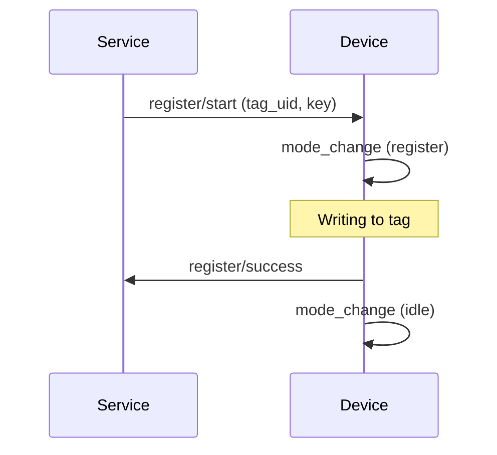
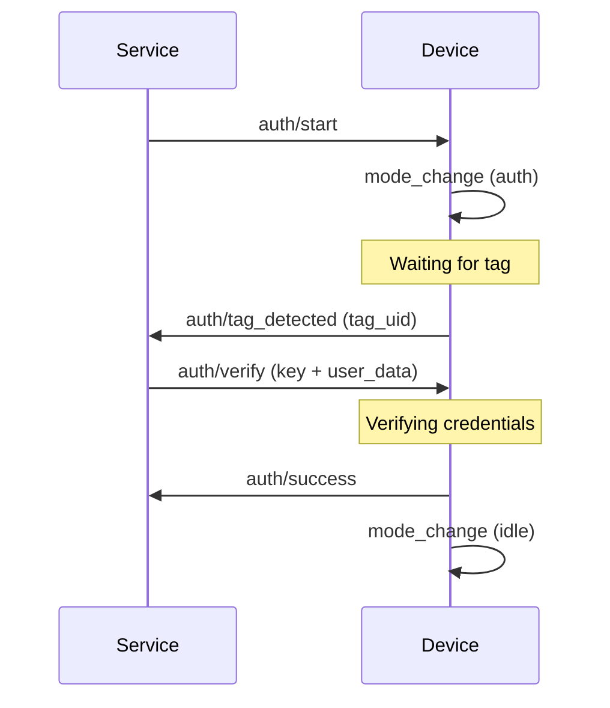
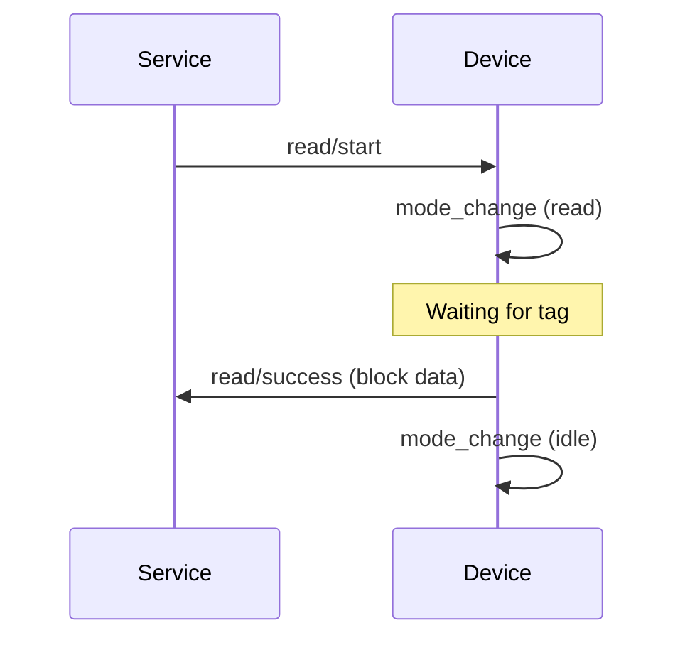

# MQTT Protocol Specification
## LibreTap TapService & TapReader


## Table of Contents
1. [Overview](#1-overview)
2. [Topic Hierarchy](#2-topic-hierarchy)
3. [Message Format](#3-message-format)
4. [Operations](#4-operations)
5. [QoS & Retention](#5-qos--retention)
6. [Error Handling](#6-error-handling)
7. [Security](#7-security)
8. [Additional Resources](#8-additional-resources)

---

## 1. Overview

This specification defines MQTT communication between ESP32-based NFC readers (TapReader) and the FastAPI backend (TapService).

### Key Principles
- **Device-Authoritative**: Devices own their state; service synchronizes on event confirmation
- **Asynchronous**: Commands return immediately; results arrive via events
- **Idempotent**: All messages include `request_id` for deduplication and tracing
- **Reliable**: QoS 1 for commands/results, QoS 0 for progress updates


---

## 2. Topic Hierarchy

### 2.1 Topic Structure
```
devices/{device_id}/{operation}/{action}
devices/{device_id}/status
devices/{device_id}/mode
devices/{device_id}/heartbeat
```

### 2.2 Operations & Actions

**Registration:**
- Commands: `devices/{device_id}/register/start`, `devices/{device_id}/register/cancel`
- Events: `devices/{device_id}/register/success`, `devices/{device_id}/register/error`

**Authentication:**
- Commands: `devices/{device_id}/auth/start`, `devices/{device_id}/auth/verify`, `devices/{device_id}/auth/cancel`
- Events: `devices/{device_id}/auth/tag_detected`, `devices/{device_id}/auth/success`, `devices/{device_id}/auth/failed`, `devices/{device_id}/auth/error`

**Read:**
- Commands: `devices/{device_id}/read/start`, `devices/{device_id}/read/cancel`
- Events: `devices/{device_id}/read/success`, `devices/{device_id}/read/error`

**Control:**
- Command: `devices/{device_id}/reset`

**State (Retained):**
- `devices/{device_id}/status` - Device online/offline
- `devices/{device_id}/mode` - Current mode: idle|register|auth|read

**Health:**
- `devices/{device_id}/heartbeat` - Periodic health metrics

---

## 3. Message Format

### 3.1 Envelope Structure
All MQTT messages use this envelope:

```json
{
  "version": "1.0",
  "timestamp": "2025-11-11T12:00:00.000Z",
  "device_id": "reader-001",
  "event_type": "auth_success",
  "request_id": "550e8400-e29b-41d4-a716-446655440002",
  "payload": { }
}
```

**Required Fields:**
- `version`: Protocol version (currently "1.0")
- `timestamp`: ISO 8601 UTC timestamp
- `device_id`: Device identifier
- `event_type`: Message type (see below)
- `request_id`: UUID v4 for operation tracking

**Event Types:**
- Commands: `register_start`, `register_cancel`, `auth_start`, `auth_verify`, `auth_cancel`, `read_start`, `read_cancel`, `reset`
- Events: `register_success`, `register_error`, `auth_tag_detected`, `auth_success`, `auth_failed`, `auth_error`, `read_success`, `read_error`
- State: `status_change`, `mode_change`, `heartbeat`

**JSON Schemas:**  
See [`/schemas`](./schemas) directory for complete JSON Schema definitions for validation.

### 3.2 Command Payloads (Service → Device)

**Register Start:**
- `tag_uid`: NFC tag UID (colon-separated hex)
- `key`: 32-character hex encryption key
- `timeout_seconds`: Operation timeout

**Auth Start:**
- `timeout_seconds`: Operation timeout

**Auth Verify:**
- `tag_uid`: Detected tag UID
- `key`: 32-character hex encryption key
- `user_data`: User authentication data (object)

**Read Start:**
- `timeout_seconds`: Operation timeout
- `read_blocks`: Array of block numbers to read

**Cancel / Reset:**
- Empty payload `{}`

For complete payload schemas with validation rules, see [`/schemas/commands.json`](./schemas/commands.json).

### 3.3 Event Payloads (Device → Service)

**Status Change:**
- `status`: "online" or "offline"
- `firmware_version`: Semantic version string
- `ip_address`: IPv4 address

**Mode Change:**
- `mode`: Current mode (idle|register|auth|read)
- `previous_mode`: Previous mode

**Tag Detected:**
- `tag_uid`: NFC tag UID
- `message`: Human-readable status message

**Success Events:**
- `tag_uid`: Tag UID
- `authenticated`: Boolean (auth only)
- `message`: Success message
- `user_data`: User data (auth only)
- `blocks_written`: Count (register only)

**Failed Events (Auth):**
- `tag_uid`: Tag UID
- `authenticated`: false
- `reason`: Failure reason

**Error Events:**
- `error`: Human-readable description
- `error_code`: Machine-parseable code
- `retry_possible`: Boolean
- `component`: Component identifier

**Heartbeat:**
- `uptime_seconds`: Device uptime
- `memory_usage_percent`: Memory usage
- `operations_completed`: Operation count

For complete event schemas with validation rules, see [`/schemas/events.json`](./schemas/events.json).

---

## 4. Operations

### 4.1 Device Lifecycle

**Startup:**
1. Device connects to MQTT broker with Last Will Testament (LWT)
2. Publishes `status_change` (online, retained)
3. Publishes `mode_change` (idle, retained)
4. Subscribes to `devices/{device_id}/#`

**LWT Configuration:**
```json
{
  "topic": "devices/{device_id}/status",
  "payload": {"status": "offline"},
  "qos": 1,
  "retain": true
}
```

### 4.2 Registration Flow



### 4.3 Authentication Flow



### 4.4 Read Flow



### 4.5 Cancel Operation
Send cancel command to abort active operation. Device returns to idle mode.

### 4.6 Reset Device
Send reset command. Device publishes `mode_change` (idle), cancels active session, and may restart.

### 4.7 Timeout Handling
- Device enforces `timeout_seconds` from command payload
- On timeout, device publishes error event with `error_code: "TIMEOUT_EXCEEDED"`
- Device returns to idle mode


---

## 5. QoS & Retention

| Topic Pattern | QoS | Retained | Purpose |
|---------------|-----|----------|---------|
| `devices/+/status` | 1 | Yes | Device availability state |
| `devices/+/mode` | 1 | Yes | Current operational mode |
| `devices/+/*/start` | 1 | No | Command delivery guarantee |
| `devices/+/*/verify` | 1 | No | Auth verification with key |
| `devices/+/*/cancel` | 1 | No | Cancel delivery guarantee |
| `devices/+/reset` | 1 | No | Reset command delivery |
| `devices/+/*/success` | 1 | No | Operation result confirmation |
| `devices/+/*/failed` | 1 | No | Auth failure confirmation |
| `devices/+/*/error` | 1 | No | Error event delivery |
| `devices/+/*/tag_detected` | 1 | No | Tag detection requires verify |
| `devices/+/heartbeat` | 0 | No | Periodic health (best effort) |

**Guidelines:**
- Use QoS 1 for all commands and terminal events (success, failed, error)
- Use QoS 0 for telemetry (heartbeat)
- Retain only state topics (status, mode)
- Avoid QoS 2 (unnecessary overhead)

---

## 6. Error Handling

### 6.1 Error Codes

| Code | Category | Description | Retry | Component |
|------|----------|-------------|-------|-----------|
| `NFC_TIMEOUT` | Communication | Tag not detected within timeout | Yes | nfc |
| `NFC_TAG_LOST` | Communication | Tag removed during operation | Yes | nfc |
| `NFC_AUTH_FAILED` | Authentication | Write authentication failed | No | nfc |
| `NFC_READ_ERROR` | Hardware | Failed to read tag | Yes | pn532 |
| `NFC_WRITE_ERROR` | Hardware | Failed to write tag | Yes | pn532 |
| `NFC_UNSUPPORTED_TAG` | Compatibility | Tag type not supported | No | nfc |
| `NFC_INVALID_KEY` | Validation | Key format invalid | No | crypto |
| `NFC_DEVICE_BUSY` | State | Device processing another operation | No | device |
| `NFC_DEVICE_ERROR` | Hardware | General hardware malfunction | Yes | device |
| `INVALID_COMMAND` | Protocol | Malformed command message | No | protocol |
| `SESSION_NOT_FOUND` | State | Unknown request_id | No | protocol |
| `TIMEOUT_EXCEEDED` | Timing | Operation exceeded max duration | Yes | device |

### 6.2 Error Message Format

All error events must include:
- `error`: Human-readable description
- `error_code`: Machine-parseable code from table above
- `retry_possible`: Boolean indicating if retry might succeed
- `component`: Optional component identifier

### 6.3 Retry Strategy

**Device-Side:**
- Read/Write errors: 2 automatic retries with 500ms delay
- Timeout errors: No retry, return to idle and publish error
- Hardware errors: No retry, publish error and await reset

**Service-Side:**
- Map error events to operation session status
- Surface errors via WebSocket to clients
- Do not force device mode changes
- Let client decide on retry

---

## 7. Security

### 7.1 Transport Security
- **Required:** MQTT over TLS 1.3 (port 8883)
- **Ciphers:** Strong cipher suites only
- **Authentication:** Username/password minimum; client certificates recommended

### 7.2 Broker Access Control (ACL)

**Service User:**
```
user tapservice
topic readwrite devices/#
```

**Device User Pattern:**
```
user device-{device_id}
topic write devices/{device_id}/#
topic read devices/{device_id}/register/start
topic read devices/{device_id}/register/cancel
topic read devices/{device_id}/auth/start
topic read devices/{device_id}/auth/verify
topic read devices/{device_id}/auth/cancel
topic read devices/{device_id}/read/start
topic read devices/{device_id}/read/cancel
topic read devices/{device_id}/reset
```

### 7.3 Payload Security
- Never log encryption keys or sensitive user_data
- Validate UUID format and timestamp (±5 minutes)
- Optionally encrypt command payloads using JWE
- Implement rate limiting: max 10 commands/minute per device

### 7.4 Validation Rules

**Device Validation:**
- Verify `request_id` is valid UUID v4
- Check timestamp within ±5 minutes
- Validate command schema matches expected format
- Deduplicate messages using recent request_id cache (last 100)

**Service Validation:**
- Verify `device_id` matches topic
- Check `request_id` exists in session manager
- Validate event_type matches expected flow
- Sanitize all fields before logging

---

## 8. Additional Resources

### Schemas
Complete JSON Schema definitions for message validation:
- [`/schemas/message-envelope.json`](./schemas/message-envelope.json) - Base envelope structure
- [`/schemas/commands.json`](./schemas/commands.json) - Command payload schemas
- [`/schemas/events.json`](./schemas/events.json) - Event payload schemas

See [`/schemas/README.md`](./schemas/README.md) for usage examples and validation best practices.

### Implementation Examples

Complete implementation examples are available in the [`/examples`](./examples) directory:

**Code Examples:**
- [`python_service.py`](./examples/python_service.py) - Python service implementation with asyncio-mqtt
- [`esp32_device.cpp`](./examples/esp32_device.cpp) - ESP32 device implementation with PubSubClient

**Flow Examples:**
- [`complete_auth_flow.md`](./examples/complete_auth_flow.md) - Complete authentication flow with all messages
- [`register_flow.md`](./examples/register_flow.md) - Tag registration flow
- [`read_flow.md`](./examples/read_flow.md) - Tag read operation flow

See [`/examples/README.md`](./examples/README.md) for detailed usage instructions.

---

## Appendix: Quick Reference

### Message Envelope
```json
{
  "version": "1.0",
  "timestamp": "ISO8601",
  "device_id": "reader-xxx",
  "event_type": "operation_action",
  "request_id": "uuid-v4",
  "payload": {}
}
```

### Common Event Types
- **Commands:** `{operation}_start`, `{operation}_cancel`, `auth_verify`, `reset`
- **Events:** `{operation}_success`, `{operation}_error`
- **Auth Specific:** `auth_tag_detected`, `auth_failed`
- **State:** `status_change`, `mode_change`, `heartbeat`

### Modes
- `idle` - Ready for operations
- `register` - Registration in progress
- `auth` - Authentication in progress
- `read` - Read operation in progress

### Status
- `online` - Device connected and operational
- `offline` - Device disconnected (LWT)

