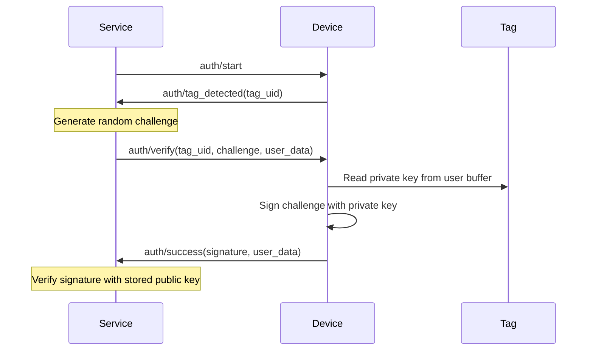

# LibreTap Protocol Roadmap

## Current Version: 1.0 (Shared Secret Model)

### Status: ✅ Implemented
The current protocol uses a **symmetric shared secret model** where:
- Service generates a 128-bit key during registration
- Device stores key in NFC tag's user buffer
- Authentication validates by comparing tag-stored key with service-provided key
- Simple, reliable, and sufficient for initial deployment

**See:** [Section 7.3](./MQTT_PROTOCOL_SPEC.md#73-cryptographic-model-shared-secret-authentication) for complete documentation.

---

## Version 2.0: Challenge-Response Model (Planned)

### 🎯 Goals
Migrate to an **asymmetric challenge-response authentication** system to address security limitations:
- Eliminate replay attack vulnerability
- Add forward secrecy with ephemeral challenges
- Reduce impact of key database compromise
- Enable true offline authentication validation
- **Add block data storage:** Write arbitrary data during registration, read during authentication

### Architecture

#### Keypair Generation & Data Storage (Registration)
1. **Device generates keypair:**
   - Private key: Stored in NFC tag's user buffer (encrypted)
   - Public key: Sent to service in `register_success` event
   
2. **Optional: Store additional data on tag:**
   - User metadata (username, permissions, etc.)
   - Application-specific data
   - Blocks beyond private key storage

3. **Service stores:**
   - `tag_uid` → `public_key` mapping in database
   - No private key knowledge (zero-trust model)

#### Challenge-Response Flow (Authentication)



#### Message Changes

**auth_verify payload (v2.0):**
```json
{
  "tag_uid": "04:A1:B2:C3:D4:E5:F6",
  "challenge": "64-character-hex-random-data",
  "user_data": { "username": "john.doe" }
}
```

**auth_success payload (v2.0):**
```json
{
  "tag_uid": "04:A1:B2:C3:D4:E5:F6",
  "authenticated": true,
  "signature": "128-character-hex-signature",
  "user_data": { "username": "john.doe" }
}
```

**register_success payload (v2.0):**
```json
{
  "tag_uid": "04:A1:B2:C3:D4:E5:F6",
  "public_key": "128-character-hex-public-key",
  "blocks_written": 8,
  "data_stored": {
    "username": "john.doe",
    "permissions": ["door_access", "elevator"]
  },
  "message": "Tag registered with keypair and user data"
}
```

**register_start payload (v2.0):** (New optional fields)
```json
{
  "tag_uid": "04:A1:B2:C3:D4:E5:F6",
  "timeout_seconds": 30,
  "user_metadata": {
    "username": "john.doe",
    "permissions": ["door_access", "elevator"]
  }
}
```

**read operation (v2.0):** Retrieve stored block data
```json
{
  "tag_uid": "04:A1:B2:C3:D4:E5:F6",
  "data": {
    "username": "john.doe",
    "permissions": ["door_access", "elevator"]
  },
  "message": "Tag data read successfully"
}
```

### Cryptographic Specifications

**Algorithm:** Elliptic Curve (ECDSA)
- Curve: secp256r1 (NIST P-256)
- Private key: 32 bytes (256 bits)
- Public key: 64 bytes uncompressed (0x04 || X || Y)
- Signature: 64 bytes (R || S components)

**Challenge Format:**
- Length: 32 bytes (256 bits)
- Encoding: Hex string (64 characters)
- Source: Cryptographically secure random (e.g., `secrets.token_bytes(32)`)
- Lifetime: Single-use, expires after 30 seconds

**Tag Storage (NTAG21x):**
- Blocks 4-7: Encrypted private key (32 bytes)
- Blocks 8+: Optional user data storage (username, permissions, etc.)
- Password protection: Enable write protection
- Optional: Store key version/format metadata

### Additional Features in v2.0

#### Block Data Storage & Reading
- **Registration:** Write arbitrary data to tag blocks during registration
- **Read operation:** Enhanced to read and return stored block data (not just tag UID)
- **Use cases:** Store username, permissions, access levels directly on tag
- **Security:** Data can be encrypted or plaintext depending on sensitivity

**v1.0 Limitation:** Only stores shared secret key; read operation returns tag UID only.

### Security Improvements

| Property | v1.0 (Shared Secret) | v2.0 (Challenge-Response) |
|----------|---------------------|---------------------------|
| **Replay attacks** | ❌ Vulnerable | ✅ Protected (ephemeral challenges) |
| **Forward secrecy** | ❌ No | ✅ Yes (unique challenge each auth) |
| **Key compromise** | ❌ Full credential loss | ✅ Per-tag isolation |
| **Cloning resistance** | ❌ Cloneable | ⚠️ Private key extractable if unencrypted |
| **Offline validation** | ✅ Yes | ✅ Yes (verify signature offline) |
| **Service key storage** | ⚠️ Must protect symmetric keys | ✅ Only public keys (lower risk) |
| **Block data storage** | ❌ Key only | ✅ Arbitrary user data supported |
| **Read operation** | ⚠️ Tag UID discovery only | ✅ Full block data reading |

### Migration Strategy

**TapReader (ESP32):**
- [ ] Integrate mbedTLS ECDSA library
- [ ] Implement keypair generation during registration
- [ ] Add secure private key storage to tag write routine
- [ ] Implement signature generation in auth flow
- [ ] Add block data write during registration
- [ ] Add block data read operation support

**TapService (FastAPI):**
- [ ] Add `public_key` field to tag database model
- [ ] Implement challenge generation (32-byte random)
- [ ] Add signature verification logic (ECDSA verify)
- [ ] Create challenge session manager (TTL: 30s)
- [ ] Add optional user metadata storage for tags
- [ ] Support block data in read responses

**Protocol Spec:**
- [ ] Define v2.0 message schemas
- [ ] Update JSON schemas for v2.0
- [ ] Add v2.0 flow diagrams
- [ ] Add security analysis comparison
- [ ] Document block data storage format and limits

### Open Questions

1. **Key encryption on tag:** Encrypt private key in user buffer? With what key?
   - Option A: Use tag's password protection only
   - Option B: Derive encryption key from tag UID + service master key
   
2. **Signature format:** Raw R||S bytes or DER-encoded?
   - Recommendation: Raw 64-byte format (simpler for embedded)

3. **Public key transmission:** Send full uncompressed or compressed point?
   - Recommendation: Compressed (33 bytes) to save bandwidth

4. **Block data format:** JSON, CBOR, or raw binary for stored user metadata?
   - Recommendation: CBOR (compact, structured, good for embedded)

5. **Data encryption on tag:** Should user metadata be encrypted or plaintext?
   - Recommendation: Configurable per-field (sensitive data encrypted, public data plaintext)

---
